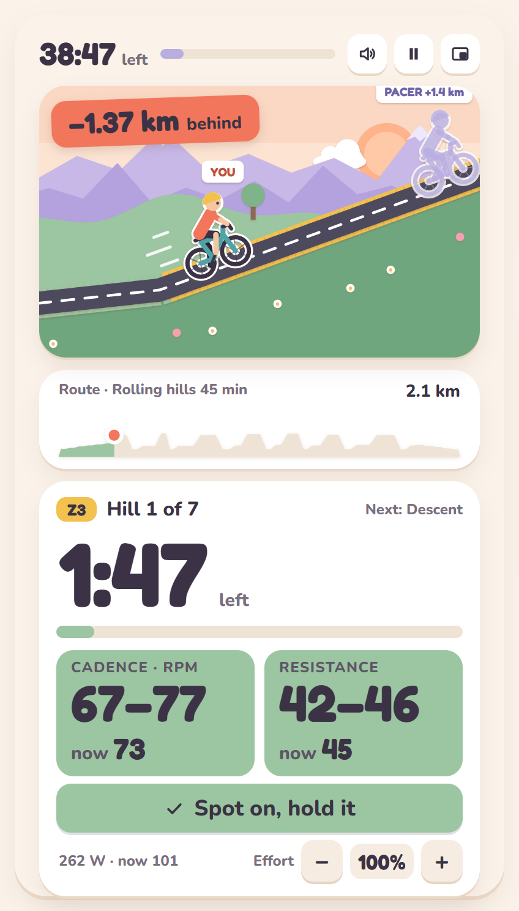
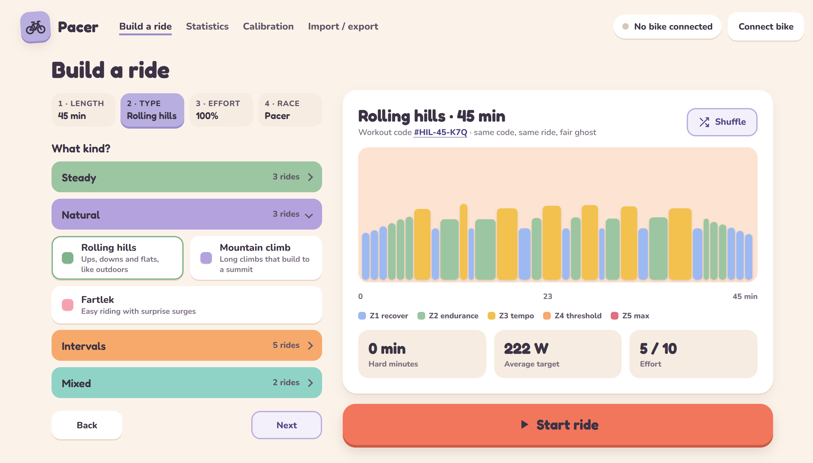
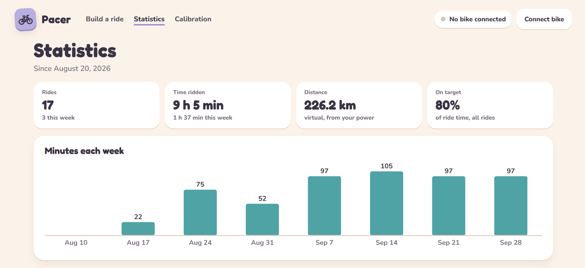
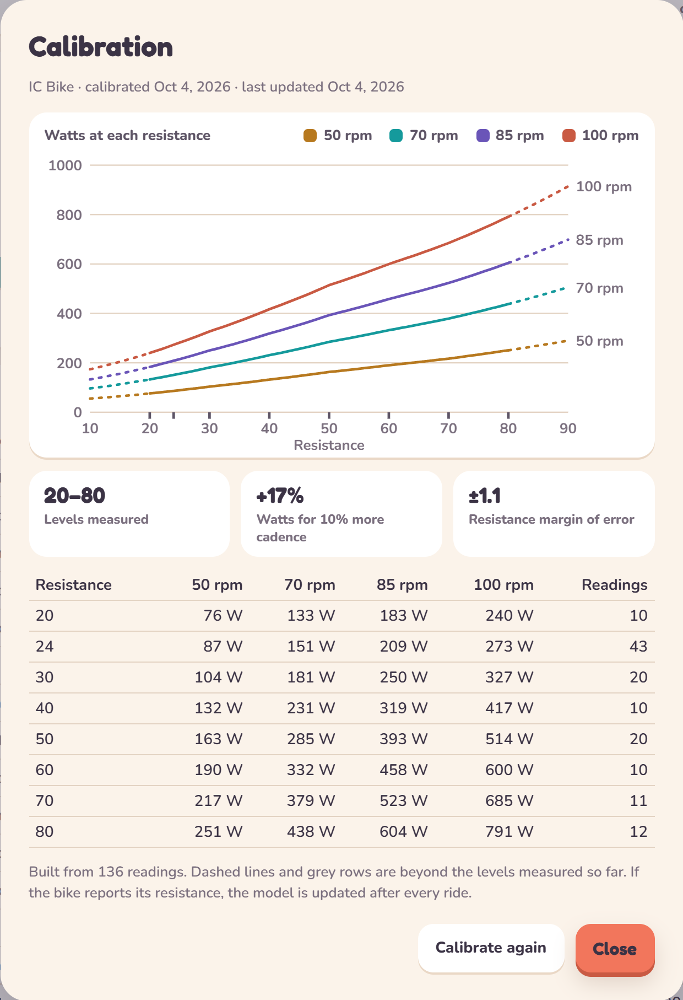

# 🚲 Pacer

**Keep your workout on track while you watch TV.**

<p align="center">
  
</p>

Pacer is a small window that sits on top of Netflix or YouTube while you ride
your spin bike. It tells you what resistance to set, how fast to pedal, and
how long until it changes.

- 📺 **Stays on top of your show**, and is readable at a glance from the saddle.
- 🎯 **Spin-class targets**: a resistance and a cadence for every step, in the
  numbers your bike's screen shows.
- 👻 **Race yourself**: every ride is a cartoon race against your best one.
- 🪶 **Lightweight**: it runs in your browser, with no account, and nothing
  leaves your computer.

Works with standard Bluetooth (FTMS) bikes such as the Schwinn 800IC / IC4 /
IC8 and Bowflex C6. Built and tested on a Schwinn 800IC.

## 🚀 Get started

**Open <https://mostcromulent.github.io/pacer/> in Chrome or Edge.** There is
nothing to install. (Firefox and Safari can't talk to Bluetooth bikes.)

1. Pedal to wake the bike, click **Connect bike** and pick it from the list.
   Close Peloton, Zwift or JRNY first: a bike takes one connection at a time.
2. Calibrate when prompted (about two and a half minutes of pedalling), then
   set your **easy pace**: the resistance and cadence you could chat at.
3. Put your show on, build a ride and press **Start ride**.

Chrome can also install Pacer as an app, from the install button in the address
bar, so it opens in a window of its own.

## 🛠️ Build a ride

<p align="center">
  
</p>

Pick a length from 10 to 120 minutes, one of seventeen kinds of ride (spin
class, steady, hills, intervals and more), how hard you want it, and who to
race. Your choices are remembered, so next time it's one click.

### 🎓 The spin class generator

**Spin class** builds an instructor-style class out of short themed blocks,
and **New class** makes a fresh one whenever you like.

- 🧱 **Sixteen kinds of block**: seated and standing climbs, cadence and
  resistance pushes, jumps, switchbacks, spin-ups, creeping climbs, Tabata,
  sprints and more. Each one's lengths and numbers vary every time it comes up.
- 📈 **A class with a shape**: it warms up, builds in waves from easier blocks
  to harder ones with recoveries between, and ends on a big finish.
- 🗣️ **Called like a class**: each block is introduced by name ("Cadence
  pushes, 3 rounds"), with badges for *Push*, *Recover*, *Add 2* and *Out of
  the saddle*.
- 🪑 **Low impact class**: the same idea kept in the saddle, with gentler
  efforts, no sprints, and resistance never above 50.
- ✂️ **Leave blocks out**: don't like jumps or sprints? Tap them off.

## 📺 During a ride

- 🟩 Two tiles, **cadence** and **resistance**, showing what you're doing now.
  Green is in range; yellow or blue with an arrow means go up or down.
- ⛰️ The road is the workout. A steeper hill means more resistance.
- 🔔 A chime warns you before each change, so your eyes can stay on the show.
  Turn on voice and each step is read out too: "Hill. Resistance 45, cadence 70."
- 🎚️ Off day? **Effort − / +** makes the rest of the ride easier or harder.

## 📈 Afterwards

A summary of the race, and **Statistics** with your totals and minutes per week.

<p align="center">
  
</p>

## 🔧 Calibration

Spin bikes estimate watts from resistance and cadence, each model in its own
way. Calibrating teaches Pacer your bike's formula, and if the bike reports
its resistance (the 800IC does) it keeps learning from every ride.

<p align="center">
  
</p>

## 🩹 Good to know

- **Bike not in the list?** Pedal to wake it, and check no other app or phone
  is connected. Shift-click **Connect bike** lists every device nearby.
- **Resistance doesn't match the bike's screen?** Calibrate again, from
  **Calibration** in the top bar.
- **Watts look high?** They're the bike's own estimate. You only race yourself,
  so it doesn't matter.
- **Your data stays in your browser.** Rides, settings and your bike's
  calibration are kept on your own computer and never sent anywhere. Clearing
  the browser's site data deletes them, so use the backup on the
  **Statistics** page now and then; it is also how you move to another browser
  or computer.

---

## 👩‍💻 Running it yourself, and contributing

Pacer is plain JavaScript with no dependencies and no build step. With
[Node.js](https://nodejs.org) 18 or newer:

```sh
npm start    # serve the app at http://localhost:5173
```

[CONTRIBUTING.md](CONTRIBUTING.md) covers how the code is laid out, how to add
a kind of ride or a spin class block, and the tests.

The screenshots above use sample rides, not real ones.

## 📄 Licence

Copyright © 2026 MostCromulent.

Pacer is free software under the [GNU General Public License](LICENSE),
version 3 or later. You can use it, change it and share it; if you share a
changed version, it has to stay open under the same licence. It comes with no
warranty.

## 🤖 How this was made

Written with [Claude Code](https://claude.com/claude-code), and tested on a
real bike.
