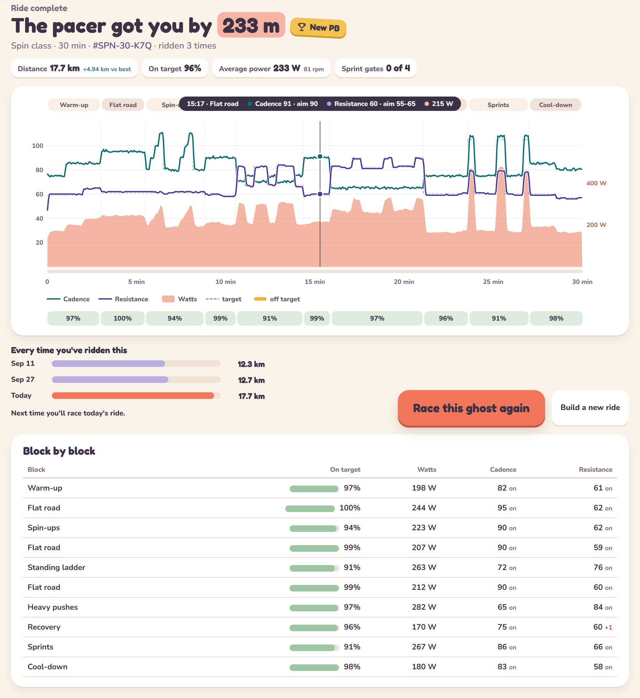

# 🚲 Pacer

**A lightweight spin-bike coach for a second screen or a small window.**

Pacer runs in a browser tab and floats a small window over whatever else is on
your screen, or sits on a phone on the handlebars. It tells you what resistance
to set, how fast to pedal, and how long until it changes, and otherwise stays
out of the way.

**[Open Pacer](https://mostcromulent.github.io/pacer/)** in Chrome or Edge.
It's free, there is nothing to install, and nothing leaves your computer.

It works best with a Bluetooth spin bike that uses the standard FTMS
protocol, such as the Schwinn 800IC / IC4 / IC8 or the Bowflex C6. No smart
bike? You can [ride without one](#-without-a-smart-bike) and follow along.

<p align="center">
  
</p>

## ✨ What it does

- **Stays small**: a mini window that floats over your other windows, readable
  at a glance from the saddle.
- **Stays light**: one web page with no account, no install and no subscription.
- **Gives spin-class targets**: a resistance and a cadence for every step, in
  the numbers your bike's screen shows.
- **Builds the ride for you**: seventeen kinds, from recovery spins to hills,
  intervals and full spin classes, for any length from 10 to 120 minutes.
- **Races you against yourself**: every ride is a cartoon race against your
  best one.

## 🚀 Getting started

1. Open <https://mostcromulent.github.io/pacer/> in Chrome or Edge.
2. Pedal to wake the bike, click **Connect bike** and pick it from the list.
   Close Peloton, Zwift or JRNY first: a bike takes one connection at a time.
3. Calibrate when prompted. It takes about two and a half minutes of pedalling
   and makes Pacer's resistance numbers match your bike's screen.
4. Set your **easy pace**: the resistance and cadence you could chat at on a flat road. Every
   ride is sized from that.
5. Build a ride and press **Start ride**. The mini window opens on top, so the
   rest of the screen is yours for a show, music or work.

## 🛠️ Building a ride

<p align="center">
  
</p>

Pick a length, a kind of ride, how hard you want it, and who to race. Your
choices are remembered, so next time it's one click.

### Spin classes

**Spin class** builds an instructor-style class from sixteen kinds of short
block (climbs, pushes, jumps, sprints and more) that builds in waves to a big
finish. **New class** makes a fresh one, the **low impact class** keeps you in
the saddle, and you can leave out any blocks you don't like.

## 📺 During a ride

- Two tiles, **cadence** and **resistance**, show what you're doing now. Green
  is in range; yellow or blue with an arrow means go up or down.
- The road is the workout: a steeper hill means more resistance.
- A chime warns you before each change, so your eyes can stay elsewhere.
  Turn on voice and each step is read out: "Hill. Resistance 45, cadence 70."
- **Effort − / +** makes the rest of the ride easier or harder.
- Stop pedalling and the ride pauses; start again and it carries on. If the
  page is closed or reloaded, you can pick the ride back up.

## 📈 Afterwards

A chart of the ride against its targets and how each block went, and
**Statistics** with your totals, minutes per week and every ride.

<p align="center">
  
</p>

## 🚲 Without a smart bike

Any exercise bike will do: click **Ride without a smart bike** and tell Pacer
what your resistance knob looks like:

- **Numbered 1 to 100**: targets are given as they are.
- **Fewer levels**, such as 1 to 8: the same targets, on your knob's scale.
- **No numbers**: each step says how heavy it should feel, from *light* to
  *very heavy*, measured from your easy pace.

Then set your easy pace on that knob. Pacer can't see what you're doing, so it
just tells you: a cadence and a resistance for every step, the countdown, the
chimes and the voice. Press play to start after a count of three, and pause it
yourself. There's no race, no score and no distance, but every ride counts
towards your minutes on the **Statistics** page.

The numbers are a guide, since every knob is different. If a ride feels too
easy or too hard, change your easy pace, or use **Effort − / +** as you ride.

It needs no Bluetooth, so it works in any browser, on an iPhone or iPad too.

## 🔧 Calibration

Spin bikes estimate watts from resistance and cadence, each model in its own
way. Calibrating teaches Pacer your bike's formula, and if the bike reports
its resistance (the 800IC does) Pacer keeps learning from every ride.

## 🩹 Troubleshooting

**Which devices work?**

| Device | Works? |
|---|---|
| Computer, in Chrome or Edge | Yes. The ride floats over your other windows |
| Android phone, in Chrome | Yes. Prop it on the handlebars as a second screen |
| Firefox or Safari | Only without a smart bike. They can't use Bluetooth |
| iPhone or iPad, any browser | Only without a smart bike. Apple doesn't let web pages use Bluetooth |

**The bike isn't in the list.** Pedal to wake it, and check no other app or
phone is connected to it. Shift-click **Connect bike** lists every Bluetooth
device nearby.

**The resistance doesn't match the bike's screen.** Calibrate again, from
**Calibration** in the top bar.

**The watts look high.** They're the bike's own estimate. You only race
yourself, so it doesn't matter.

**Where is my data?** Rides, settings and your bike's calibration are kept in
your browser, on your own computer, and never sent anywhere. Clearing the
browser's site data deletes them, so use the backup on the **Statistics** page
now and then. It is also how you move to another browser or computer.

**Can I install it?** Chrome can install Pacer as an app, from the install
button in the address bar, so it opens in a window of its own.

## 👩‍💻 Running it yourself, and contributing

Pacer is plain JavaScript with no dependencies and no build step. With
[Node.js](https://nodejs.org) 18 or newer:

```sh
npm start    # serve the app at http://localhost:5173
```

[CONTRIBUTING.md](CONTRIBUTING.md) covers how the code is laid out, how to add
a kind of ride or a spin class block, and the tests.

The screenshots use sample rides, not real ones.

## 📄 Licence

Copyright © 2026 MostCromulent.

Pacer is free software under the [GNU General Public License](LICENSE),
version 3 or later. You can use it, change it and share it; if you share a
changed version, it has to stay open under the same licence. It comes with no
warranty.

## 🤖 How this was made

Written with [Claude Code](https://claude.com/claude-code), and tested on a
real bike.
